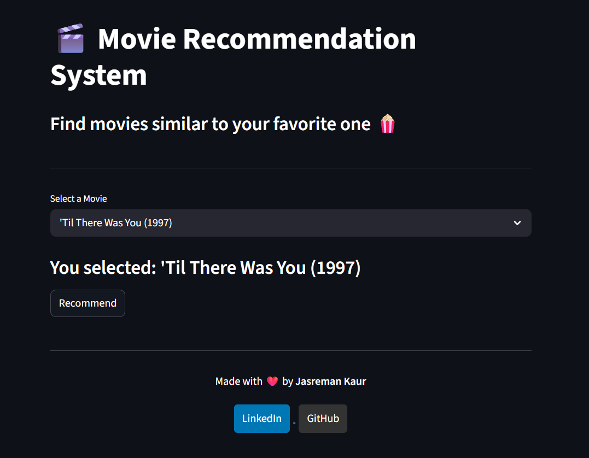
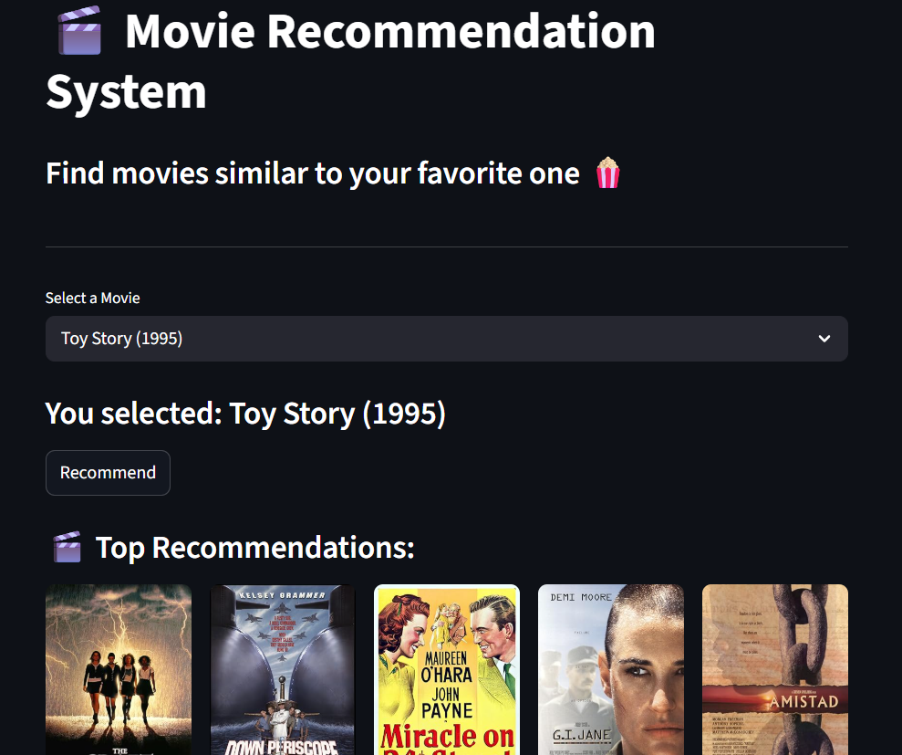
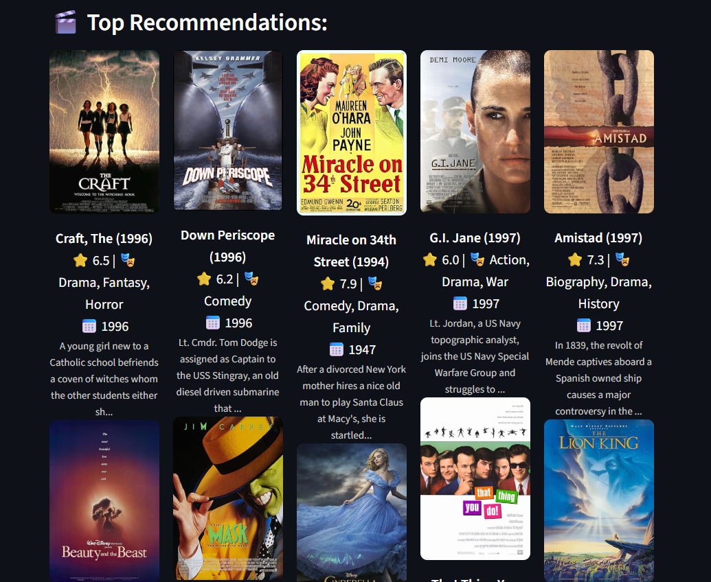
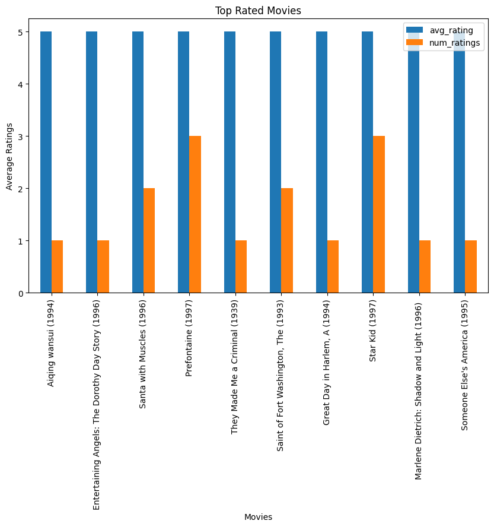
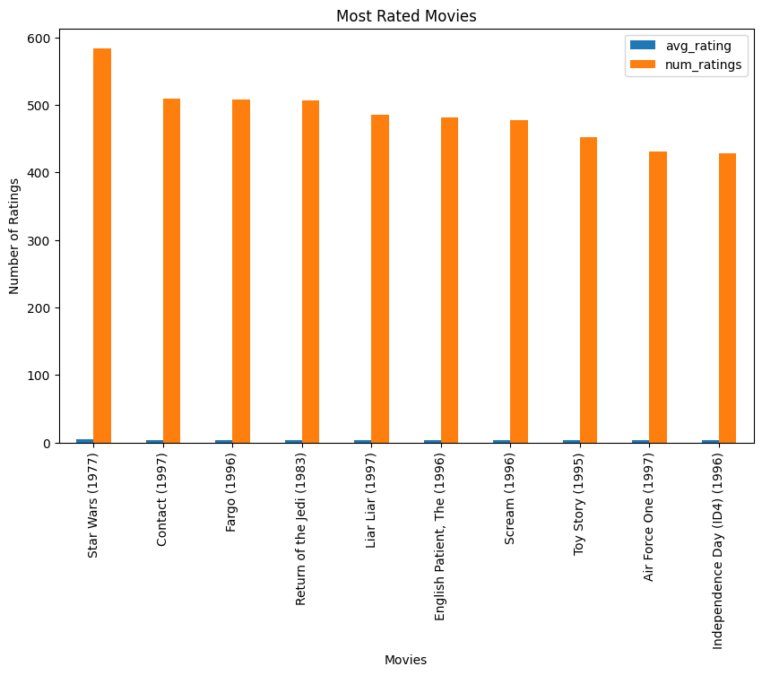
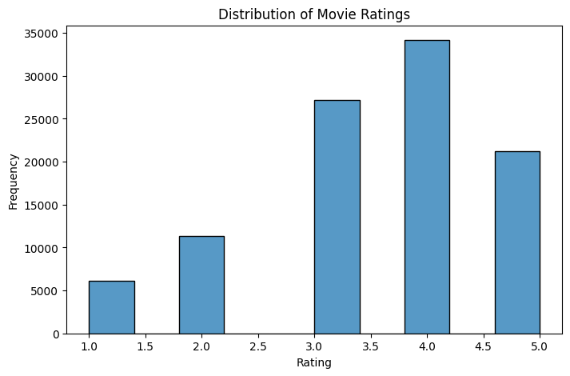
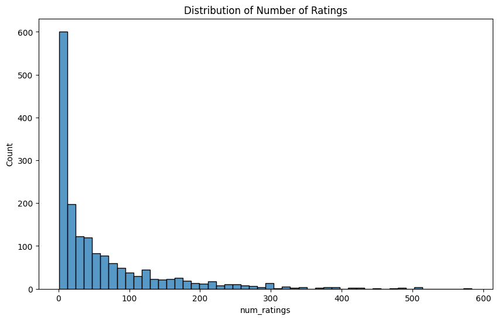
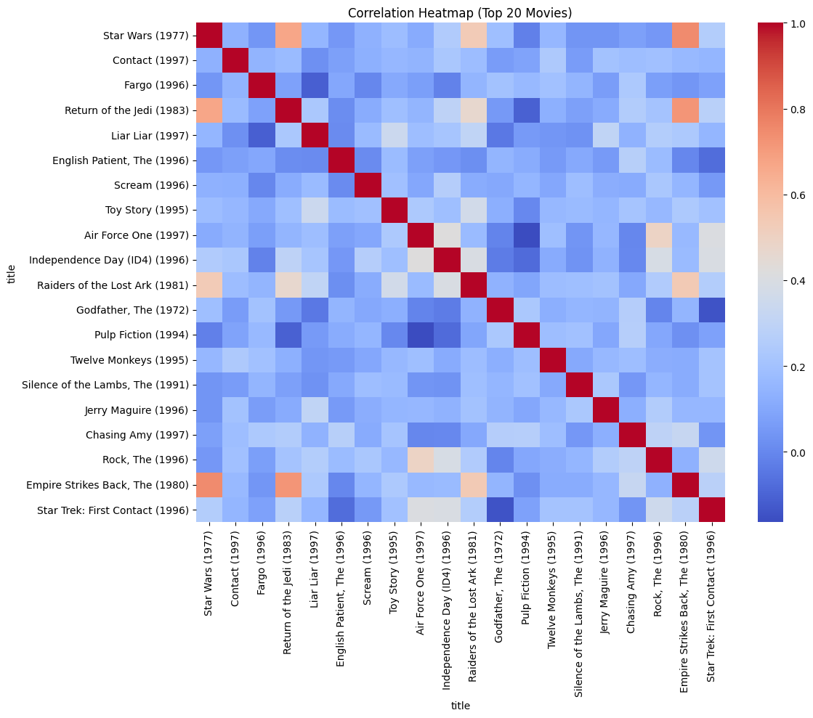

# 🎬 Movie Recommendation System

## 📌 Project Overview
This project is a **Movie Recommendation System** built using the MovieLens dataset.  
It recommends movies similar to a given movie based on user ratings using **collaborative filtering**.

---

## 🌐 Live Demo
👉 https://movie-recommendation-system-mxrku7zeefoqlc3rjfnxf6.streamlit.app/

---

## 📸 App Preview

### 🟢 Home Screen


> 🎬 Initial view of the app before selecting a movie

### 🎯 Movie Selection & Recommendation


> 🍿 User selects a movie and gets similar movie recommendations

### ⭐ Top Recommendations Display


> 🖼️ Displays recommended movies with posters and details

---

## 🎯 Objective
To build a system that suggests relevant movies to users by analyzing rating patterns and similarities between movies.

---

## ✨ Features

- 🎬 Movie recommendations based on user similarity  
- ⭐ Filter movies by minimum number of ratings  
- 🖼️ Movie posters fetched using OMDb API  
- 🎨 Interactive UI built with Streamlit  
- ⚡ Fast and real-time recommendations  

---

## 📂 Project Structure
```
movie-recommendation-system/
│
├──.streamlit/
│   └── config.toml
│
├── data/
│   ├── Movie_Id_Titles
│   └── u.data
│
├── images/
│   ├── app_screenshot_1.png
│   ├── app_screenshot_2.png
│   ├── app_screenshot_3.png
│   ├── correlation_heatmap.png
│   ├── most_rated_movies.png
│   ├── ratings_count_distribution.png
│   ├── rating_distribution.png
│   └── top_rated_movies.png
│
├── notebooks/
│   └── movie-recommendation.ipynb
│
├── app.py 
├── README.md 
└── requirements.txt 
```

---

## 📊 Dataset
- MovieLens Dataset  
- Contains:
  - User IDs
  - Movie IDs
  - Ratings
  - Movie Titles  

---

## ⚙️ Technologies Used
- Python  
- Pandas  
- NumPy  
- Matplotlib  
- Seaborn
- Streamlit  
- Requests (API integration) 

---

## 🧠 Methodology

### 1. Data Preprocessing
- Loaded ratings and movies datasets  
- Merged datasets using `item_id`  

### 2. Exploratory Data Analysis (EDA)
- Analyzed:
  - Most rated movies  
  - Highest rated movies  
- Created visualizations:
  - Rating distribution  
  - Number of ratings distribution  
  - Top movies bar charts  
  - Correlation heatmap  

### 3. Feature Engineering
- Created a **user-movie matrix** using pivot table  

### 4. Recommendation System
- Used **Collaborative Filtering**  
- Applied **Pearson Correlation** to find similar movies  

```python
movie_matrix.corrwith()
```

---

## 📈 Visualizations

### 🔹 Top Rated Movies


### 🔹 Most Rated Movies


### 🔹 Rating Distribution


### 🔹 Ratings Count Distribution


### 🔹 Correlation Heatmap


---

## 🔍 How It Works

1. User selects a movie  
2. System finds similarity with other movies using correlation  
3. Filters movies with sufficient number of ratings  
4. Recommends top similar movies  

---

## 📈 Key Insights

- Popular movies tend to have more stable ratings  
- Movies with very few ratings can have misleading high averages  
- Correlation works better when filtering movies with sufficient ratings  
- User behavior patterns help in identifying similar movies  

---

## ⚙️ Run Locally

```bash
git clone https://github.com/Jasreman003/movie-recommendation-system.git
cd movie-recommendation-system
pip install -r requirements.txt
streamlit run app.py

---

## 🔐 API Key Setup

This project uses OMDb API to fetch movie posters.

Create a `.streamlit/secrets.toml` file and add:

API_KEY = "your_api_key"

---

## 🙌 Author

**Jasreman Kaur**  
Aspiring Data Analyst  

- 💼 LinkedIn: https://www.linkedin.com/in/jasreman-kaur-818568298
- 🔗 GitHub: https://github.com/Jasreman003
